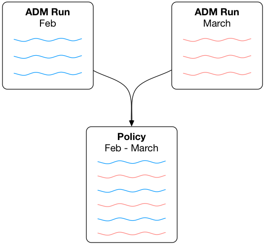

# Tetration ADM Carry-over-Tool

This app is designed to join the result of two ADM runs together

To operate the app:

1. Run ADM on the initial data set
2. Select the workspace in this app, leave the app running
3. Run ADM on the second data set
4. Continue running the app to merge the two result sets